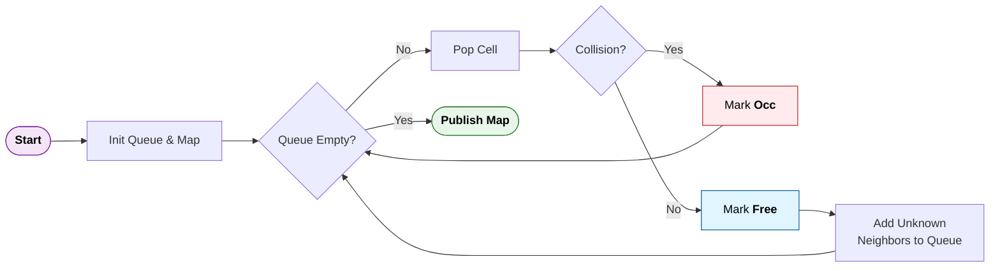

# Gazebo ROS 2 2D Map Plugin

**Automatically generate 2D occupancy maps from Gazebo 11 (Classic) worlds for ROS 2 Humble.**

This Gazebo WorldPlugin creates occupancy grid maps for robot navigation without running SLAM. It works by slicing the Gazebo world at a configurable height and identifies obstacles through ray casting and collision detection.

> [!NOTE]
> This version is for **Gazebo 11 (Classic)**. For Gazebo Fortress (Ignition), see the `fortress` branch.

## Table of Contents

- [Features](#features)
- [Quick Start](#quick-start)
  - [Installation](#installation)
  - [Automated Generation (Recommended)](#automated-generation-recommended)
  - [Manual Method](#manual-method)
- [How it Works](#how-it-works)
- [Configuration](#configuration)
- [Python Integration](#python-integration)
- [Visualization](#visualization)
- [Troubleshooting](#troubleshooting)
- [ROS 2 API](#ros-2-api)
- [Requirements](#requirements)
- [Important Notes](#important-notes)
- [Credits and License](#credits-and-license)

## Features

- **Automatic map generation** from any Gazebo world
- **Auto-detection** of world bounds (no manual sizing needed)
- **Origin-aligned** maps (centered at world origin 0,0)
- **Fully automated** script (plugin injection, generation, cleanup)
- **Subprocess-ready** for Python integration
- **ROS 2 Humble** compatible with Gazebo 11 Classic

## Requirements

- ROS 2 Humble
- Gazebo 11 (Classic)
- `nav2_map_server` (for saving maps): `sudo apt install ros-humble-nav2-map-server`

## Quick Start

### Installation

```bash
cd ~/ros2_ws/src
git clone https://github.com/Miguesji/gazebo_ros2_2Dmap_plugin.git
cd ~/ros2_ws
colcon build --packages-select gazebo_ros2_2dmap_plugin
source install/setup.bash
```

### Automated Generation (Recommended)

The easiest way - automatically injects plugin, generates map, and cleans up:

```bash
# Basic usage
ros2 run gazebo_ros2_2dmap_plugin generate_map.sh <world_file> [output_dir]

# Example
ros2 run gazebo_ros2_2dmap_plugin generate_map.sh ~/my_world.sdf ~/maps
```

**Output:** Creates `my_world.yaml` and `my_world.pgm` (automatically named from world file)

The script performs these steps automatically:

1. Detects if plugin is in world file (injects if missing)
2. Launches Gazebo in headless mode (no graphical interface)
3. Generates occupancy map
4. Saves map files
5. Cleans up automatically

### Manual Method

If you prefer manual control:

**1. Add plugin to your world file** (inside `<world>` tags):

```xml
<plugin name='gazebo_occupancy_map' filename='libgazebo_2Dmap_plugin.so'>
    <map_resolution>0.05</map_resolution>  <!-- 5cm per cell -->
    <map_height>0.2</map_height>           <!-- slice at 20cm height -->
    <!-- Omit map_size_x and map_size_y for auto-detection -->
    <init_robot_x>0</init_robot_x>         <!-- start from origin -->
    <init_robot_y>0</init_robot_y>
</plugin>
```

**2. Launch Gazebo:**

```bash
gazebo my_world.sdf
```

**3. Generate map:**

```bash
ros2 service call /gazebo_2Dmap_plugin/generate_map std_srvs/srv/Empty
```

**4. Save map:**

```bash
ros2 run nav2_map_server map_saver_cli -f ~/maps/my_map --ros-args -r map:=map2d
```

## How it Works

The plugin uses a hybrid approach of **wavefront exploration** and **physics-based geometry checking** to generate the map:

1.  **Exploration Seed**: The process starts at the user-defined `init_robot_x` and `init_robot_y` (this must be free space!).
2.  **Breadth-First Search (BFS)**: It performs a wavefront expansion (BFS) cell-by-cell to identify all reachable areas from the start point.
3.  **Collision Checking**: For each cell encountered during traversal, the plugin uses Gazebo's physics engine to perform a collision check at the specified `map_height`.
4.  **State Marking**:
    -   If the physics engine detects a collision, the cell is marked as **Occupied** (100).
    -   If no collision is detected, the cell is marked as **Free** (0) and added to the wavefront to explore its neighbors.
    -   Cells never reached by the wavefront remain **Unknown** (-1).
5.  **Publishing**: Once the queue is empty, the resulting `nav_msgs/OccupancyGrid` is published once to the `/map2d` topic.



## Configuration

### Plugin Parameters

| Parameter | Default | Description |
|-----------|---------|-------------|
| `map_resolution` | 0.05 | Cell size in meters |
| `map_height` | 0.2 | Height to slice world in meters (0.2-0.5m typical) |
| `map_size_x` | auto | Map width - **omit for auto-detection** |
| `map_size_y` | auto | Map height - **omit for auto-detection** |
| `map_margin` | 2.0 | Extra space in meters around auto-detected bounds |
| `init_robot_x` | 0.0 | Starting X coordinate for exploration (must be free space) |
| `init_robot_y` | 0.0 | Starting Y coordinate for exploration (must be free space) |

### Auto-Detection

When you omit `map_size_x` and `map_size_y`, the plugin automatically determines the map size:

- Analyzes all models in the world
- Computes bounding box of all objects
- Centers map at world origin (0,0)
- Sizes map to fit all objects plus the specified margin

## Python Integration

Recommended for automated workflows:

```python
import subprocess
import os

def generate_map(world_file, output_dir="./maps"):
    """Generate map automatically."""
    os.makedirs(output_dir, exist_ok=True)
    
    result = subprocess.run([
        'ros2', 'run', 'gazebo_ros2_2dmap_plugin', 'generate_map.sh',
        world_file, output_dir
    ], capture_output=True, text=True, timeout=60)
    
    if result.returncode == 0:
        map_name = os.path.splitext(os.path.basename(world_file))[0]
        return {
            'yaml': f"{output_dir}/{map_name}.yaml",
            'pgm': f"{output_dir}/{map_name}.pgm"
        }
    raise RuntimeError(result.stderr)

# Usage
files = generate_map("/path/to/world.sdf", "./maps")
print(f"Generated: {files['yaml']}")
```

**Batch processing:**

```bash
for world in ~/worlds/*.sdf; do
    ros2 run gazebo_ros2_2dmap_plugin generate_map.sh "$world" ~/maps
done
```

## Visualization

View your map in RViz2:

```bash
ros2 run rviz2 rviz2
```

1. Add → By topic → `/map2d` → Map
2. Set Fixed Frame to `odom`
3. View your map!

**Colors:**

- **White** = Free space
- **Black** = Occupied (walls/obstacles)
- **Gray** = Unknown (not explored)

## Troubleshooting

**Map is all gray/unknown**

- Ensure `init_robot_x/y` is in free space (not inside a wall)
- The plugin uses wavefront exploration, which spreads outward from the initial position to identify free space. If the starting position is blocked, exploration cannot proceed.

**Map doesn't fit all objects**

- Increase `map_margin` parameter (try 3.0 or 5.0)
- Check auto-detection logs for computed bounds

**Walls too thick/thin**

- Adjust `map_height` (try 0.2-0.5m range)
- Verify collision geometries exist in models

**Script hangs/doesn't exit**

- The script should exit automatically
- Check `/tmp/gazebo_map_gen.log` for errors
- Ensure ROS 2 workspace is sourced

**Plugin not found**

- Verify build: `ls install/gazebo_ros2_2dmap_plugin/lib/libgazebo_2Dmap_plugin.so`
- Check plugin path: `echo $GAZEBO_PLUGIN_PATH`

## ROS 2 API

### Topics

- `/map2d` (`nav_msgs/msg/OccupancyGrid`) - Published map data. Uses transient local QoS, which means late-joining subscribers receive the last published message.

### Services

- `/gazebo_2Dmap_plugin/generate_map` (`std_srvs/srv/Empty`) - Triggers map generation

## Important Notes

- **Remove robots** from world before generating map (they appear as obstacles)
- **Starting position** (`init_robot_x/y`) must be in free space for exploration to work
- **Frame ID** is set to `odom` (modify source code if you need a different frame)
- **Map origin** is always centered at world origin (0,0) when using auto-detection

## Credits and License

This package is licensed under the MIT License.

Forked from [marinaKollmitz/gazebo_ros_2Dmap_plugin](https://github.com/marinaKollmitz/gazebo_ros_2Dmap_plugin), originally based on ETH Zürich's [octomap plugin](https://github.com/ethz-asl/rotors_simulator/tree/master/rotors_gazebo_plugins). This version adds ROS 2 Humble support, Gazebo 11 Classic compatibility, automatic map sizing, and automated generation scripts.
